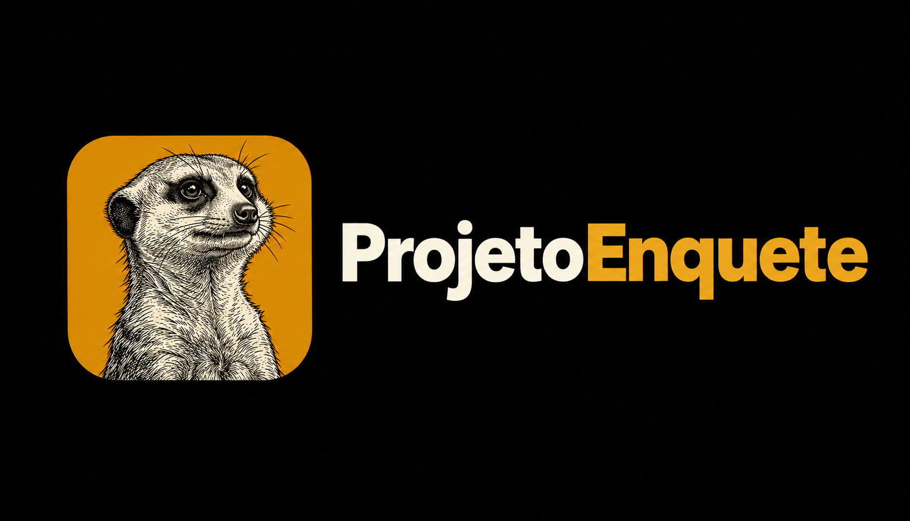
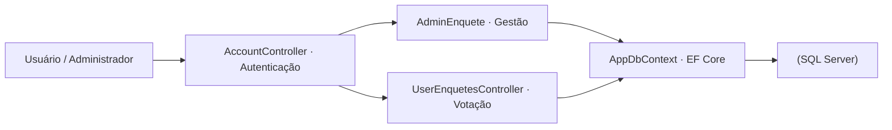

<p align="center"></p>

<p align="center">Plataforma de enquetes com autenticação, perfis de acesso e persistência em SQL Server.</p>


<p align="center"><a href="#visão-geral">Visão geral</a> &nbsp;·&nbsp; <a href="#recursos">Recursos</a> &nbsp;·&nbsp; <a href="#como-executar">Como executar</a></p>

---

<a id="explore-o-projeto"></a>

## Por onde começar


- **[Enquetes](ProjetoPWEnquete/Controllers/EnqueteController.cs)** — Ações relacionadas às enquetes.
- **[Banco de dados](ProjetoPWEnquete/Data/AppDbContext.cs)** — Contexto de persistência da aplicação.
- **[Conta](ProjetoPWEnquete/Controllers/AccountController.cs)** — Ações relacionadas ao acesso dos usuários.


<a id="visão-geral"></a>

## Sobre o projeto

O sistema conta com controladores especializados para autenticação (AccountController), administração de enquetes (AdminEnquete), participação do usuário (UserEnquetesController) e exibição geral (EnqueteController), apoiados por um histórico detalhado de migrações do **Entity Framework Core**.

<a id="recursos"></a>

## Recursos

**Painel Administrativo (AdminEnquete)**<br>
Criação, edição, ativação e encerramento de enquetes com acompanhamento de votos.

**Área do Participante (UserEnquetesController)**<br>
Fluxo dedicado para visualização de enquetes disponíveis e registro seguro do voto.

**Autenticação e Perfis (AccountController)**<br>
Gerenciamento de contas e sessões integrado ao banco de dados via Identity / EF Core.

**Persistência SQL Server (AppDbContext)**<br>
Mapeamento relacional completo com mais de 10 migrações incrementais documentando a evolução do schema.

## Arquitetura



```mermaid
flowchart LR
    A["Usuário / Administrador"] --> B["AccountController · Autenticação"]
    B --> C["AdminEnquete · Gestão"]
    B --> D["UserEnquetesController · Votação"]
    C --> E["AppDbContext · EF Core"]
    D --> E
    E --> F["(SQL Server)"]
```


## Estrutura do repositório


```text
ProjetoPWEnquete/
├── assets/
│   └── identity/banner.png               Banner do projeto
├── ProjetoPWEnquete/
│   ├── Controllers/                        Account, AdminEnquete, Enquete, Home e UserEnquetes
│   ├── Data/AppDbContext.cs                Contexto relacional do Entity Framework Core
│   ├── Migrations/                         Histórico evolutivo do schema SQL Server
│   ├── Models/ & Views/                    Entidades de domínio e telas Razor (.cshtml)
│   └── Program.cs                          Configuração de autenticação, EF Core e rotas
├── ProjetoPWEnquete.sln                    Solução Visual Studio
└── README.md
```


<a id="como-executar"></a>

## Como executar

1. Clone o repositório:
   ```powershell
   git clone https://github.com/arthurlynow098/ProjetoPWEnquete.git
   cd ProjetoPWEnquete
   ```
2. Configure sua string de conexão do **SQL Server** em ProjetoPWEnquete/appsettings.json.
3. Aplique as migrações e inicie a aplicação:
   ```powershell
   dotnet ef database update --project ProjetoPWEnquete
   dotnet run --project ProjetoPWEnquete/ProjetoPWEnquete.csproj
   ```

---

<p align="center">
  <a href="https://github.com/arthurlynow098">GitHub</a> &nbsp;·&nbsp;
  <a href="https://arthurentsev.vercel.app/">Portfólio</a> &nbsp;·&nbsp;
  <a href="https://www.linkedin.com/in/entsevarthur/">LinkedIn</a>
</p>

## Identidade visual e créditos

**Suricato** — Atenção coletiva e participação em grupo. [Logo em PNG](assets/identity-v2/logo.png).

Identidade organizada a partir das artes fornecidas por Arthur Entsev. Direção visual e organização documental inspiradas em [LynowCut](https://github.com/arthurlynow098/LynowCut) e [LynowCatch](https://github.com/arthurlynow098/LynowCatch). Tipografia **Inter**, com licença SIL Open Font License em [Inter-OFL.txt](assets/identity-v2/Inter-OFL.txt).
